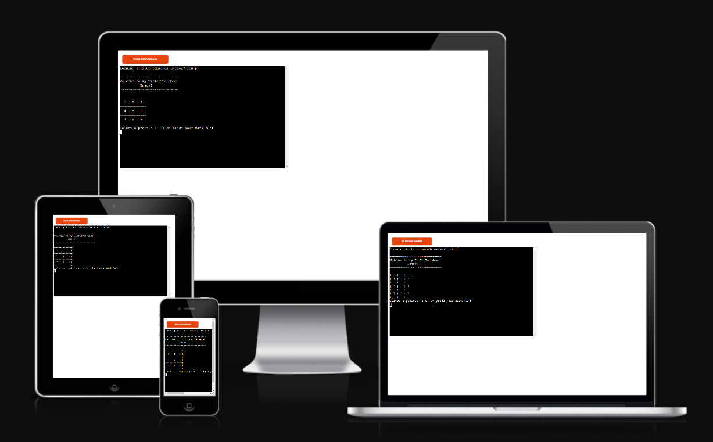
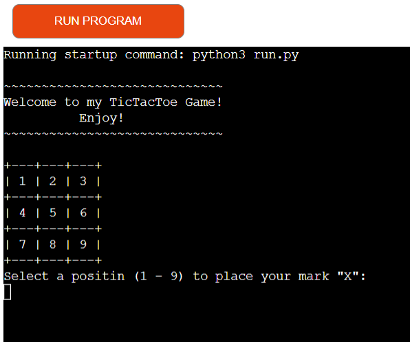
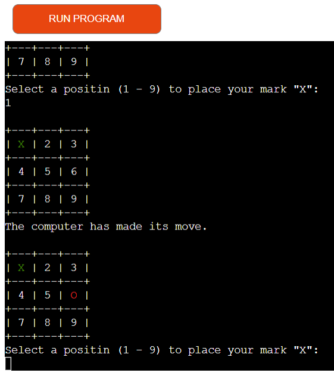
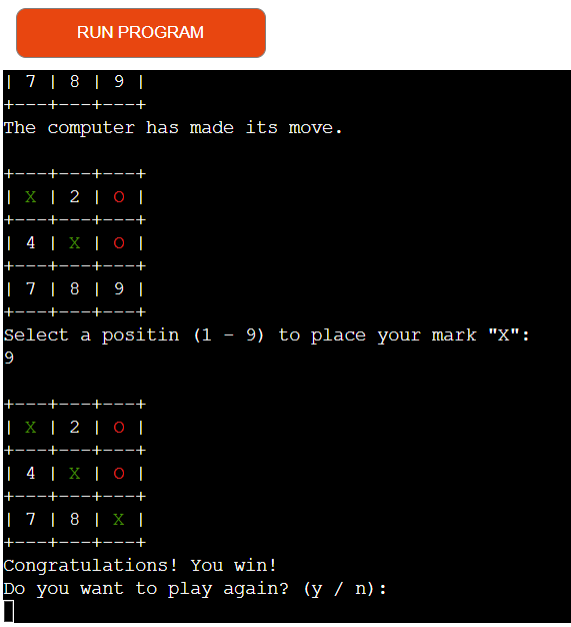
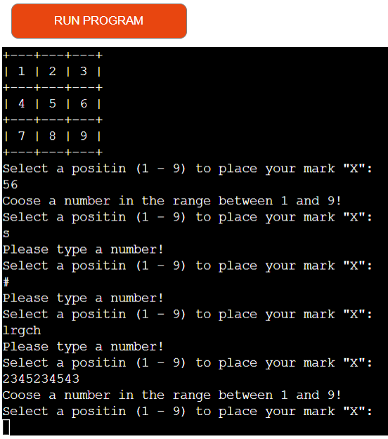
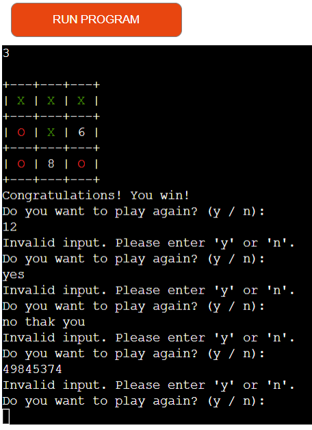
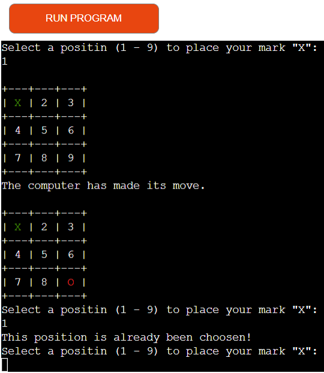
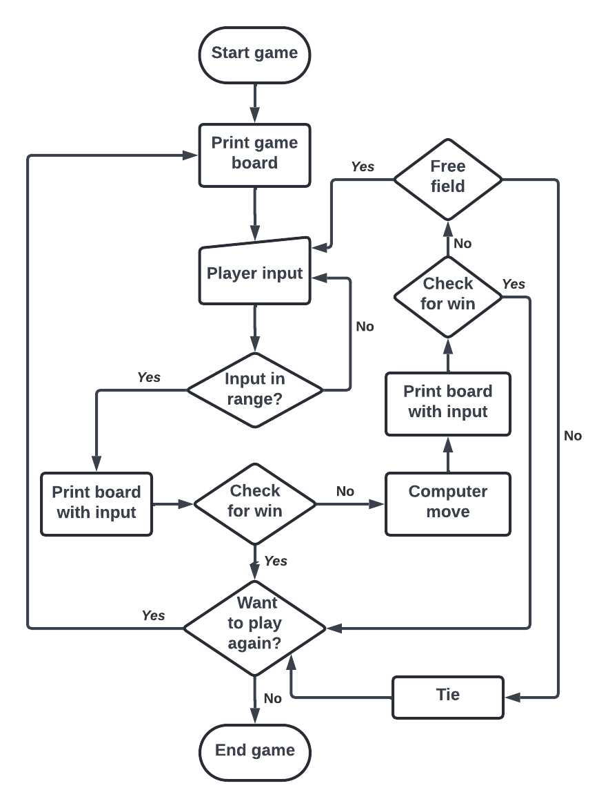
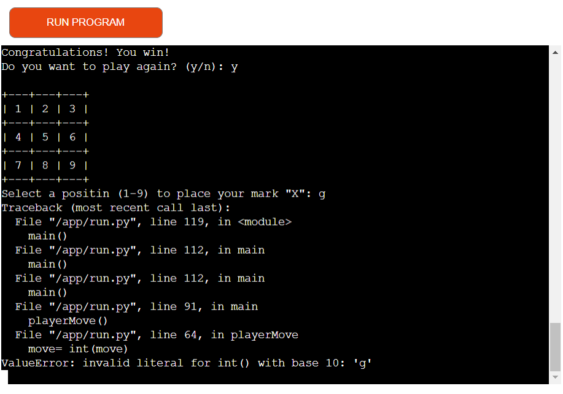

# Tic Tac Toe Game

Tic Tac Toe Game is a Python-based game that runs in the mock terminal in Heroku.

The user can try to beat the computer by putting his marks on the board and trying to build a row of 3 before the computer does.

[Here is the live version of my project](https://tictact-068cd7ef6bf7.herokuapp.com/)

## How to play

Tic-tac-toe is played on a three-by-three grid by two players, in this case player and computer, who alternately place the marks X and O in one of the nine spaces in the grid. Players soon discover that the best play from both parties leads to a tie. You can read more about the game on [Wikipedia](https://en.wikipedia.org/wiki/Tic-tac-toe).

## Features

### Existing features

- At the beginning of the game, the user sees the 3x3 grid with numerated fields.

- For more user-friendliness, the user can start the game by choosing a field.
- User's choice is marked with a green X.
- The computer chooses automatically and is marked with a red O.

- The game continues until the program detects a win situation or there are no more free fields on the gameboard.

- After every game, the user is asked if he wants to play again. By typing "y" or "n", he makes the decision.

- The program only accepts input from 1 to 9 during the game and only "y" or "n" to choose whether to play again or not.

- The user is not able to choose a taken field.

### Future features

- Implement different levels of difficulty with own AI.
- Implement a way for the player to choose the difficulty level before starting the game.
- Provide feedback to the player during the game to indicate the AI's difficulty level.

## Data Model

I decided to create a game board, that shows the numbers of the fields, so the player can choose easily. Each field on the board can hold either "X","O", or a number, which indicates, that the field isn't ocupated.  

The player is asked to choose a number 1-9 in order to make his move. The program is checking if the player's input is valid number within the range and if the chosen position is free before updating the board with the player's mark.  

The computer move is calculated by checking the current state of the game board and generating a random number in the range. 
The board is updated after every move.  

The "check_winner()" function checks the winning conditions after every move. If it detects a winning situation (horisontaly, verticaly or diagonaly) it returnes True, indicating a win.  

The "main()" function organises the game flow, including player moves, computer moves, checking for a winner, and handling play again functionality.

## Testing

 I have manualy tested the project by:
- Passed the code through PEP8 liner.
- Tested in my own terminal and in the Heroku app terminal.

### Bugs
#### Solved Bugs:

- By playing the game in the beginning the program was giving an error if the user's input was unvalid, which I fixed. 

- Passing the code through PEP8 liner showed a lot of issues, that I fixed.

#### Unsolved Bugs:

- None

## Deployment

The project was deployed using the Code Insitute's mock terminal for Heroku.
 - Steps of deployment:
    - Clone the repository
    - Create a new Heroku app
    - Set the buildpacks to Python and NodeJS
    - Link the Heroku app to the repository
    - Deploy

## Credits

1. Code Institute for the deployment terminal.
2. Different [YouTube](https://www.youtube.com/) tutorials for ideas how to build the game.
3. [Wickipedia](https://en.wikipedia.org/wiki/Tic-tac-toe) for the exact rules of the game.
4. [ChatGPT](https://chat.openai.com/) for helping correct some typos.

