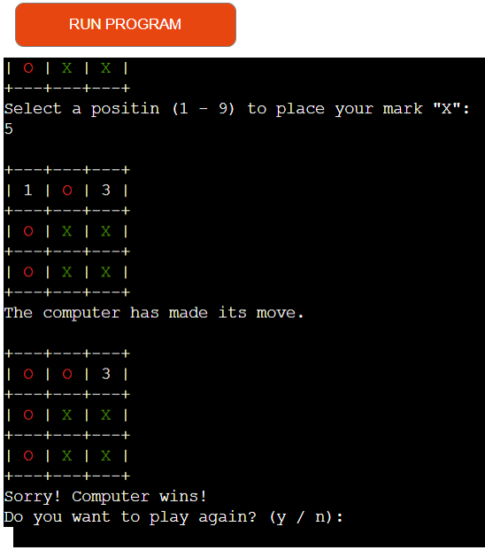
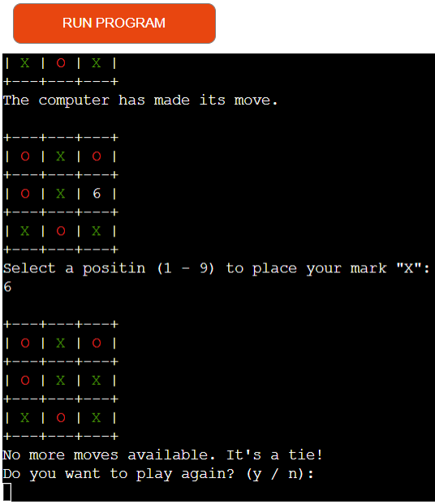

# Tic Tac Toe Game

Tic Tac Toe Game is a Python-based game that runs in the mock terminal in Heroku.

The user can try to beat the computer by putting his marks on the board and trying to build a row of 3 before the computer does.

[Here is the live version of my project](https://tictact-068cd7ef6bf7.herokuapp.com/)

## How to play

Tic-tac-toe is played on a three-by-three grid by two players, in this case player and computer, who alternately place the marks X and O in one of the nine spaces in the grid. Players soon discover that the best play from both parties leads to a tie. You can read more about the game on [Wikipedia](https://en.wikipedia.org/wiki/Tic-tac-toe).

## Features

### Existing features

- At the beginning of the game, the user sees the 3x3 grid with numerated fields.

- For more user-friendliness, the user can start the game by choosing a field.
- User's choice is marked with a green X.
- The computer chooses automatically and is marked with a red O.

- The game continues until the program detects a win situation or there are no more free fields on the gameboard.

- After every game, the user is asked if he wants to play again. By typing "y" or "n", he makes the decision.

- The program only accepts input from 1 to 9 during the game and only "y" or "n" to choose whether to play again or not.

- The user is not able to choose a taken field.

